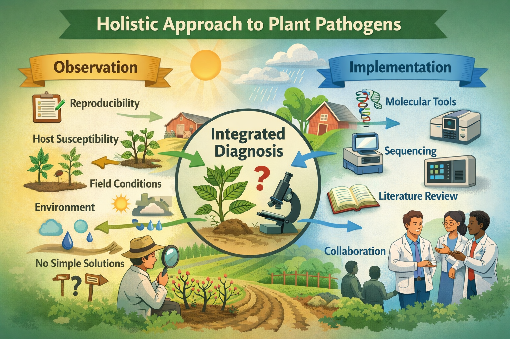

::: {.course-hero}
::: {.course-hero-copy}
Penn State · Spring semester · 4 credits

# From disease concepts to research strategy

Fundamentals of Phytopathology is an advanced tutorial in the theories, evidence, and methods used to understand plant disease. Students connect pathogen biology, host susceptibility, environment, and time while learning to evaluate literature and design rigorous research.

Primary literatureCase studiesScientific writingTeam-taught

:::

::: {.course-hero-image}
{alt="Illustration connecting field observations, diagnostics, molecular tools, and collaboration in plant pathology"}

*Plant diagnosis and research require evidence from the field, laboratory, literature, and environment.*
:::
:::

## Course overview

PPATH 505 builds on an introductory plant pathology (PPAT 405) course. It revisits foundational ideas about Koch's postulates foundation, biological lifestyles, and evolutionary approaches change the questions plant pathologists can answer.

The course is organized as a series of faculty-led modules. Dr. Ricardo I. Alcalá Briseño leads foundational instruction in plant-pathology concepts and a hands on laboratory on molecular phylogenetics.

## Learning outcomes

By the end of the course, students should be able to:

- Evaluate the uses and limitations of Koch’s postulates, disease cycles, symptoms, signs, and diagnostic evidence.
- Compare pathogen nutritional strategies and lifestyles, including biotrophy, necrotrophy, hemibiotrophy, and saprotrophy.
- Use molecular markers, phylogenies, population data, and genomes to infer pathogen natural history.
- Connect mechanisms of parasitism and plant immunity to disease development and management.
- Produce accurate, concise, fully referenced scientific arguments and research strategies.

## Representative module sequence

::: {.course-outline}
| Module | Central questions | Representative topics and activities |
|---|---|---|
| **1 · Concepts in plant pathology** | What constitutes evidence that a biological agent causes disease? | History and germ theory; Koch’s postulates and their limitations; disease cycles; diagnostics; symptoms and signs; pathogen diversity; symbiosis and microbial lifestyles |
| **2 · Pathology as natural history** | How do ancestry, reproduction, geography, environment, and time explain a pathosystem? | Disease triangle through time; molecular markers; alignments; phylogenies; population structure; genomic inference; emerging-disease case studies |
| **3 · Mechanisms of parasitism** | How do pathogens enter, colonize, feed on, and manipulate plants? | Infection structures; enzymes and toxins; effectors; host specificity; biotrophy, necrotrophy, and hemibiotrophy |
| **4 · Plant defense** | How do plants recognize pathogens and limit disease? | Pattern-triggered and effector-triggered immunity; signaling; resistance genetics; defense tradeoffs; linking mechanisms to management |
:::

## Signature assignments

### Limits of Koch’s postulates

Students identify diseases or pathogens for which classical postulates cannot be fulfilled, explain why, and evaluate alternative evidence for causation.

### Plant Disease Note

Students write a concise, publication-style disease report using primary evidence, appropriate diagnostic support, and the conventions of professional plant-pathology communication.

### Microbial nutrition and lifestyles

Students classify pathogen strategies, compare historical and contemporary terminology, and defend examples from the literature.

### Current gaps in plant pathology

Students identify an important theoretical, technical, or applied gap; justify its significance; and propose a research direction grounded in evidence.

### Critical literature presentation

Students explain a research paper’s rationale, methods, results, and conclusions, then propose alternative interpretations and next experiments beyond their own specialty area.

## Representative assessment approach

The course uses four modules worth 100 points each. A typical module combines:

::: {.assessment-grid}
::: {.assessment-item}
Evidence

**Referenced scientific writing**
:::

::: {.assessment-item}
Analysis

**Case studies and literature critique**
:::

::: {.assessment-item}
Communication

**Presentations and peer discussion**
:::

::: {.assessment-item}
Synthesis

**Module examinations or research planning**
:::
:::

## How students work

- Read primary research with attention to assumptions, uncertainty, and alternative explanations.
- Discuss unfamiliar methods in a constructive, question-driven environment.
- Practice moving from observation to diagnosis, hypothesis, evidence, and management implications.
- Write concise answers in which claims are verifiable and fully referenced.
- Apply concepts to fungal, oomycete, bacterial, viral, and other plant pathosystems.

::: {.course-note}
This is a representative course preview. PPATH 505 is team-taught, and module instructors, topics, assignments, dates, and policies may change in the official semester syllabus.
:::
