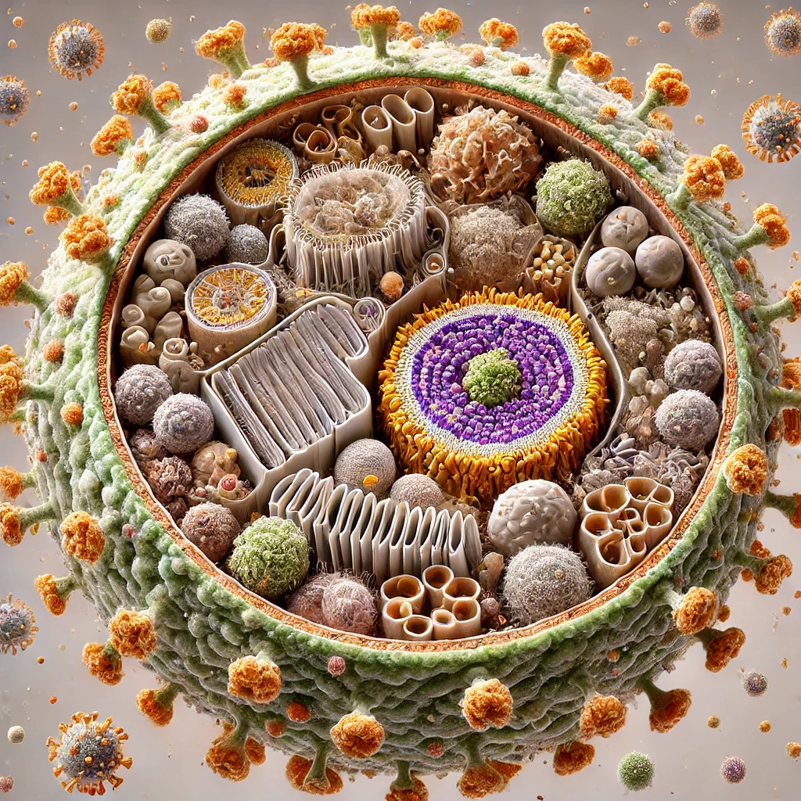

Our courses connect foundational theory with current research, scientific literature, data analysis, and collaborative problem-solving. Students learn by discussing evidence, evaluating real pathosystems, and developing research ideas—not only by memorizing terminology.

::: {.teaching-grid}

::: {.course-card}
{alt="Conceptual illustration of a virus-infected cell"}

::: {.course-card-body}
PPEM 454 · Fall

## [Virus Ecology](virus-ecology.qmd)

Viruses as ecological and evolutionary forces: diversity, host interactions, epidemics, viromes, metagenomics, and One Health.

Interactive lecturesJournal discussionsResearch project

[View course preview](virus-ecology.qmd){.software-card-link}
:::
:::

::: {.course-card}
{alt="Illustration connecting field observations, diagnostics, molecular tools, and collaboration in plant pathology"}

::: {.course-card-body}
PPATH 505 · Spring

## [Fundamentals of Phytopathology](fundamentals-plant-pathology.qmd)

An advanced, evidence-centered examination of disease concepts, pathogen biology, natural history, parasitism, and plant defense.

Case studiesPrimary literatureScientific writing

[View course preview](fundamentals-plant-pathology.qmd){.software-card-link}
:::
:::

:::

::: {.course-note}
**Course-preview notice:** These pages are representative, public-facing summaries. Official schedules, grading details, assignments, and university policies are provided to enrolled students through the current Penn State syllabus and Canvas course.
:::
